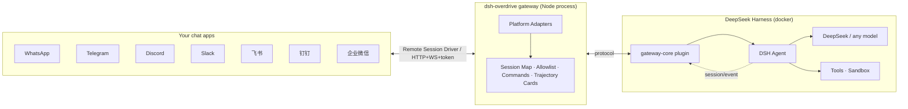

# ⚡ dsh-overdrive

> **The OpenClaw of DeepSeek Harness — turn DSH into the chat agent you can see thinking, ready in one command.**

**English** | [**中文**](README.zh-CN.md)

`dsh-overdrive` is the **Hermes Agent / OpenClaw alternative built on DeepSeek Harness** — bridging into **WhatsApp · Telegram · Discord · Slack · 飞书 · 钉钉 · 企业微信**, with the difference they don't have: **every thought and tool call is visible inside the chat**, and dangerous operations always wait for your tap.

[](LICENSE)
[](https://github.com/temotee2103/dsh-overdrive/actions/workflows/ci.yml)
[](https://github.com/deepseek-ai/DeepSeek-Harness)
[](https://www.npmjs.com/package/@dsh-overdrive/gateway-core)
[](#supported-platforms)
[](https://github.com/awesome-dsh-plugin/awesome-dsh-plugin)

---

## Why not just OpenClaw?

Hermes / OpenClaw give you a terminal agent behind 20+ chat channels — but it's a **black box**. You see the answer, not the work.

DSH's append-only session log is the one thing they can't copy. `dsh-overdrive` makes that power **chat-native**:

- 🧠 **See it think** — `/trace` replays the agent's full reasoning & tool-call trajectory as a summary card, right in the chat
- 🤖 **Command a team** — `/task` spawns parallel subagents, `/cron 0 9 * * * …` schedules recurring jobs on a built-in scheduler
- 🔒 **You approve the dangerous stuff** — a risky tool call pauses until you tap **✅ Approve / 🚫 Reject** (native buttons on Telegram / Discord / Slack / WhatsApp)
- 🚀 **One command to deploy** — `docker compose up`, scan a QR, start chatting. No public URL needed for most platforms.

---

## What it looks like

<p align="center">
  
</p>

<details>
<summary>As plain text / 纯文本版</summary>

```
You:  帮我看看这个项目有多少个包
Agent:
       📋 Trajectory (2 steps)
       🧠 Analyzing message
       🛠️ mock.tool: echo
       ✅ Mock agent received: 帮我看看这个项目有多少个包

You:  /task 写一句营销口号
Agent:
       🤖 Subagent spawned
       ✅ Task done 5c399346…

You:  /cron 0 9 * * * 每天给我一条技术新闻
Agent:
       ⏰ Cron job registered

You:  dangerous rm -rf /
Agent:
       ⚠️ Approval required: run dangerous operation (valid 120s)
       [✅ Approve] [🚫 Reject]   ← one tap, the agent continues or stops
```

</details>

<details>
<summary>🎬 Full demo script → docs/demo.md</summary>

Follow the 3-minute script in [docs/demo.md](docs/demo.md): chat → `/trace` replay → `/task` subagent → `/cron` schedule → approval tap → wrap-up.
</details>

---

## Supported platforms

| Platform | Integration | Status |
|---|---|---|
| **Telegram** | Bot API (long-polling) | ✅ verified on real DSH (2026-08-16) |
| **WhatsApp** | Baileys + QR pairing, native interactive buttons | ✅ |
| **Discord** | Bot token, native buttons | ✅ |
| **Slack** | Socket Mode (no public URL) | ✅ |
| **飞书 Feishu** | Official SDK, WS long-connection | ✅ |
| **钉钉 DingTalk** | Stream mode (WebSocket, no public URL) | ✅ |
| **企业微信 WeCom** | Callback API (AES) | ✅ |
| **WeChat** (personal) | iLink / ClawBot protocol (experimental, v0.2b) | 🧪 已实现，需真实设备验证 |
| CLI | stdin/stdout (dev & E2E) | ✅ |

## Quick start

**Docker — one command (recommended):**

```bash
git clone https://github.com/temotee2103/dsh-overdrive && cd dsh-overdrive
cp deploy/.env.example .env        # fill DEEPSEEK_API_KEY + TELEGRAM_BOT_TOKEN
docker compose -f deploy/docker-compose.yml up -d --build
# Console http://localhost:3190/   DSH Web UI http://localhost:3080/
```

**Already running DSH? One line:**

```bash
npx dsh-overdrive-setup        # guided setup: API key + platform tokens (verified live)
dsh plugin --profile web add @dsh-overdrive/gateway-core   # plugin
npx dsh-overdrive-gateway                                   # gateway
```

> **gateway-core 的 token 配置**（DSH 侧与 gateway 进程共用一个 token）：
> - 设置环境变量 `DSH_OVERDRIVE_TOKEN=<token>` 后重启 `dsh web`，或
> - 在 profile 的 `cordis.patch.yml` 覆盖条目：`- update: [{ id: overdrive-gateway-core, config: { token: <token> } }]`
> - 未配置 token 时插件**以禁用态加载**（打印告警、桥接不启动），**不会**阻塞 `dsh` 启动，可随时补配后重启。

First message to your bot? Run `/help` inside the chat. Full options: [docs/quickstart.md](docs/quickstart.md)

## Don't code? Do this.

No terminal skills needed. dsh-overdrive is designed to be **installed by one person, used by everyone**.

1. Ask a tech-savvy friend for **10 minutes**
2. Send them this:

   **macOS / Linux:**
   ```bash
   curl -fsSL https://raw.githubusercontent.com/temotee2103/dsh-overdrive/main/install.sh | bash
   ```
   **Windows:** download [install.ps1](https://raw.githubusercontent.com/temotee2103/dsh-overdrive/main/install.ps1), right-click → "Run with PowerShell" (or double-click)

3. The installer asks 3 questions (API key → platform → bot token) and starts everything for you
4. From then on **you** just chat: send messages, `/help` for commands, tap **✅ Approve / 🚫 Reject** for dangerous actions

> 中文：不需要会写代码。找懂行的朋友花 10 分钟装好，之后你只需要聊天：发消息、`/help`、危险操作点【同意/拒绝】。

## Chat commands

| Command | What it does |
|---|---|
| `/help` | List commands |
| `/trace` | Replay the latest turn's trajectory (thoughts + tool calls) |
| `/task <prompt>` | Spawn a subagent |
| `/cron <min hour dom mon dow> <prompt> [--tz <IANA>]` | Schedule a recurring job (optional timezone) |
| `/crons` | List scheduled cron jobs (with next run time) |
| `/cronrm <task-id>` | Delete a scheduled cron job |
| `/remind in 10 分钟 <text>` | One-shot reminder (`at HH:MM` also works) |
| `/context <topic>` | Bind a topic to this conversation (`off` clears, no arg shows) |
| `/remember <fact>` | Remember something about the user (long-term memory) |
| `/recall <query>` | Recall relevant memories |
| `/forget <memory-id>` | Delete a memory |
| `/send <path>` | Send a local file/image into this chat |
| `/status` | Adapter / memory / cron status overview |
| `/digest` · `/digest daily 09:00` | Instant or scheduled daily summary |
| `/feed add <rss-url>` · `/feed list` · `/feed rm <id>` | RSS subscriptions pushed into the chat |
| `/agents` | Subagent status (simplified) |
| `/new` | Reset the conversation |

> Agent-produced files (images/docs) are **auto-sent** to the chat at the end of each turn (scan the agent workspace, base64 over the protocol).

> Group chats: with `GROUP_MENTION=1`, the agent only responds in groups when mentioned / replied (private chats always respond). Long replies are auto-chunked with `(i/n)` markers; approvals accept keywords too (`批准` / `拒绝` / `yes` / `no`).

## Architecture



`packages/gateway-core` is a **DSH plugin** (`dsh.bundle.patch` ready) exposing a Remote Session Driver API; `packages/gateway` is a standalone multi-platform gateway. The "soul" — trajectory, approval, multi-agent — lives in the plugin, so the narrative survives plugin-API churn.

## Development

```bash
npm install
npm run build
npx vitest run     # 128+ unit tests
npm run e2e        # full-stack mock E2E (message / approval / allowlist)
```

## Docs

- 📦 [Quick start](docs/quickstart.md) · 🎬 [Demo script](docs/demo.md) · 📣 [Launch plan](docs/launch.md) · 📤 [npm publishing](docs/publish.md)
- 🧪 [Platform acceptance checklist](docs/smoke-platforms.md)
- 📐 [Design spec](docs/superpowers/specs/2026-08-16-dsh-overdrive-design.md) · 🔭 [DSH interface research](docs/interface-report.md)

## Roadmap

- [x] M1–M2b: protocol, real DSH bridge, international platforms
- [x] M3: 飞书 / 钉钉 / 企业微信
- [x] M4: trajectory cards, `/task` `/cron`, streaming typing, media, WhatsApp native buttons
- [x] M5: docker-compose, web console, MIT + CI, npm distribution
- [x] v0.2a: ASR voice transcription (OpenAI-compatible endpoint, `ASR_API_KEY`), Feishu interactive approval cards, DingTalk actionCard approval
- [x] v0.2b: personal WeChat via official iLink / ClawBot protocol (experimental — implemented, needs real-device verification)

## 📚 Listings

Listed in community indexes and curated lists:

| List | Entry |
| --- | --- |
| [awesome-dsh-plugin](https://github.com/awesome-dsh-plugin/awesome-dsh-plugin) (community pick) | `dsh-overdrive#gateway-core` |
| [dsh-index](https://github.com/Sunrisepeak/dsh-index) (official plugin index) | `dsh-overdrive` |
| [0xsline/awesome-deepseek-harness](https://github.com/0xsline/awesome-deepseek-harness) | `dsh-overdrive` |
| [Dominic789654/awesome-deepseek-harness](https://github.com/Dominic789654/awesome-deepseek-harness) | `dsh-overdrive` |
| [Anil-matcha/awesome-dsh-plugin](https://github.com/Anil-matcha/awesome-dsh-plugin) | `dsh-overdrive` |
| [losebird/dsh-plugin-market](https://github.com/losebird/dsh-plugin-market) | `dsh-overdrive` |

## License

[MIT](LICENSE) © dsh-overdrive contributors
