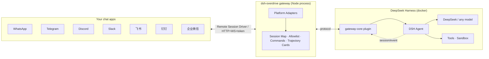

# ⚡ dsh-overdrive

> **The OpenClaw of DeepSeek Harness — turn DSH into the chat agent you can see thinking, ready in one command.**

**English** | [**中文**](README.zh-CN.md)

`dsh-overdrive` is the **Hermes Agent / OpenClaw alternative built on DeepSeek Harness** — bridging into **WhatsApp · Telegram · Discord · Slack · 飞书 · 钉钉 · 企业微信**, with the difference they don't have: **every thought and tool call is visible inside the chat**, and dangerous operations always wait for your tap.

[](LICENSE)
[](https://github.com/temotee2103/dsh-overdrive/actions/workflows/ci.yml)
[](https://github.com/deepseek-ai/DeepSeek-Harness)
[](https://www.npmjs.com/package/@dsh-overdrive/gateway-core)
[](#supported-platforms)

---

## Why not just OpenClaw?

Hermes / OpenClaw give you a terminal agent behind 20+ chat channels — but it's a **black box**. You see the answer, not the work.

DSH's append-only session log is the one thing they can't copy. `dsh-overdrive` makes that power **chat-native**:

- 🧠 **See it think** — `/trace` replays the agent's full reasoning & tool-call trajectory as a summary card, right in the chat
- 🤖 **Command a team** — `/task` spawns parallel subagents, `/cron 0 9 * * * …` schedules recurring jobs on a built-in scheduler
- 🔒 **You approve the dangerous stuff** — a risky tool call pauses until you tap **✅ Approve / 🚫 Reject** (native buttons on Telegram / Discord / Slack / WhatsApp)
- 🚀 **One command to deploy** — `docker compose up`, scan a QR, start chatting. No public URL needed for most platforms.

---

## What it looks like

<p align="center">
  
</p>

<details>
<summary>As plain text / 纯文本版</summary>

```
You:  帮我看看这个项目有多少个包
Agent:
       📋 Trajectory (2 steps)
       🧠 Analyzing message
       🛠️ mock.tool: echo
       ✅ Mock agent received: 帮我看看这个项目有多少个包

You:  /task 写一句营销口号
Agent:
       🤖 Subagent spawned
       ✅ Task done 5c399346…

You:  /cron 0 9 * * * 每天给我一条技术新闻
Agent:
       ⏰ Cron job registered

You:  dangerous rm -rf /
Agent:
       ⚠️ Approval required: run dangerous operation (valid 120s)
       [✅ Approve] [🚫 Reject]   ← one tap, the agent continues or stops
```

</details>

<details>
<summary>🎬 Full demo script → docs/demo.md</summary>

Follow the 3-minute script in [docs/demo.md](docs/demo.md): chat → `/trace` replay → `/task` subagent → `/cron` schedule → approval tap → wrap-up.
</details>

---

## Supported platforms

| Platform | Integration | Status |
|---|---|---|
| **Telegram** | Bot API (long-polling) | ✅ verified on real DSH (2026-08-16) |
| **WhatsApp** | Baileys + QR pairing, native interactive buttons | ✅ |
| **Discord** | Bot token, native buttons | ✅ |
| **Slack** | Socket Mode (no public URL) | ✅ |
| **飞书 Feishu** | Official SDK, WS long-connection | ✅ |
| **钉钉 DingTalk** | Stream mode (WebSocket, no public URL) | ✅ |
| **企业微信 WeCom** | Callback API (AES) | ✅ |
| CLI | stdin/stdout (dev & E2E) | ✅ |

## Quick start

**Docker (recommended):**

```bash
git clone https://github.com/temotee2103/dsh-overdrive && cd dsh-overdrive
export DEEPSEEK_API_KEY=sk-...            # model
export GATEWAY_ADAPTERS=telegram,whatsapp # platforms you want
export TELEGRAM_BOT_TOKEN=123456:ABC...   # platform credentials
docker compose -f deploy/docker-compose.yml up -d
# Console http://<host>:3190/   DSH Web UI http://<host>:3080/
```

**From source:**

```bash
npm install && npm run build
GATEWAY_ADAPTERS=telegram TELEGRAM_BOT_TOKEN=<token> node packages/gateway/dist/index.js
```

First message to your bot? Run `/help` inside the chat.

## Chat commands

| Command | What it does |
|---|---|
| `/help` | List commands |
| `/trace` | Replay the latest turn's trajectory (thoughts + tool calls) |
| `/task <prompt>` | Spawn a subagent |
| `/cron <min hour dom mon dow> <prompt>` | Schedule a recurring job (built-in 5-field scheduler) |
| `/agents` | Subagent status (simplified) |
| `/new` | Reset the conversation |

## Architecture



`packages/gateway-core` is a **DSH plugin** (`dsh.bundle.patch` ready) exposing a Remote Session Driver API; `packages/gateway` is a standalone multi-platform gateway. The "soul" — trajectory, approval, multi-agent — lives in the plugin, so the narrative survives plugin-API churn.

## Development

```bash
npm install
npm run build
npx vitest run     # 128+ unit tests
npm run e2e        # full-stack mock E2E (message / approval / allowlist)
```

## Docs

- 📦 [Quick start](docs/quickstart.md) · 🎬 [Demo script](docs/demo.md) · 📣 [Launch plan](docs/launch.md) · 📤 [npm publishing](docs/publish.md)
- 🧪 [Platform acceptance checklist](docs/smoke-platforms.md)
- 📐 [Design spec](docs/superpowers/specs/2026-08-16-dsh-overdrive-design.md) · 🔭 [DSH interface research](docs/interface-report.md)

## Roadmap

- [x] M1–M2b: protocol, real DSH bridge, international platforms
- [x] M3: 飞书 / 钉钉 / 企业微信
- [x] M4: trajectory cards, `/task` `/cron`, streaming typing, media, WhatsApp native buttons
- [x] M5: docker-compose, web console, MIT + CI, npm distribution
- [ ] v0.2: personal WeChat (experimental), ASR voice transcription, Feishu/DingTalk native cards

## License

[MIT](LICENSE) © dsh-overdrive contributors
