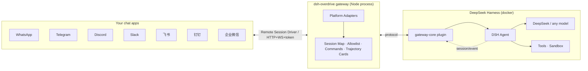

# ⚡ dsh-overdrive

> **Turn DeepSeek Harness into the chat agent you can see thinking — and command from any messaging app.**

`dsh-overdrive` bridges DeepSeek Harness (DSH) into **WhatsApp · Telegram · Discord · Slack · 飞书 · 钉钉 · 企业微信** — with a difference Hermes / OpenClaw don't have: **every thought and tool call is visible inside the chat**, and dangerous operations always wait for your tap.

[](LICENSE)
[](https://github.com/temotee2103/dsh-overdrive/actions/workflows/ci.yml)
[](https://github.com/deepseek-ai/DeepSeek-Harness)
[](#supported-platforms)

---

## Why not just OpenClaw?

Hermes / OpenClaw give you a terminal agent behind 20+ chat channels — but it's a **black box**. You see the answer, not the work.

DSH's append-only session log is the one thing they can't copy. `dsh-overdrive` makes that power **chat-native**:

- 🧠 **See it think** — `/trace` replays the agent's full reasoning & tool-call trajectory as a summary card, right in the chat
- 🤖 **Command a team** — `/task` spawns parallel subagents, `/cron 0 9 * * * …` schedules recurring jobs on a built-in scheduler
- 🔒 **You approve the dangerous stuff** — a risky tool call pauses until you tap **✅ 同意 / 🚫 拒绝** (native buttons on Telegram / Discord / Slack / WhatsApp)
- 🚀 **One command to deploy** — `docker compose up`, scan a QR, start chatting. No public URL needed for most platforms.

> 中文速览：把 DeepSeek Harness 变成聊天软件里"看得见思考过程、可以随时指挥团队"的私人 agent。WhatsApp 扫码即用，一条命令部署。

---

## What it looks like

```
You:  帮我看看这个项目有多少个包
Agent:
       📋 轨迹（2 步）
       🧠 分析消息
       🛠️ mock.tool: echo
       ✅ Mock agent received: 帮我看看这个项目有多少个包

You:  /task 写一句营销口号
Agent:
       🤖 子任务已派出
       ✅ 任务完成 5c399346…

You:  /cron 0 9 * * * 每天给我一条技术新闻
Agent:
       ⏰ 定时任务已注册

You:  dangerous rm -rf /
Agent:
       ⚠️ 需要批准：执行危险操作（120s 内有效）
       [✅ 同意] [🚫 拒绝]   ← 点一下，agent 继续或停止
```

<details>
<summary>🎬 完整演示剧本（docs/demo.md）</summary>

按 [docs/demo.md](docs/demo.md) 的 3 分钟剧本录制：普通对话 → `/trace` 轨迹回放 → `/task` 子任务 → `/cron` 定时任务 → 审批按钮 → 收尾。
</details>

---

## Supported platforms

| Platform | 接入 | Status |
|---|---|---|
| **Telegram** | Bot API (long-polling) | ✅ 真机验证通过 (2026-08-16) |
| **WhatsApp** | Baileys + QR pairing, native interactive buttons | ✅ |
| **Discord** | Bot token, native buttons | ✅ |
| **Slack** | Socket Mode (no public URL) | ✅ |
| **飞书 Feishu** | Official SDK, WS long-connection | ✅ |
| **钉钉 DingTalk** | Stream mode (WebSocket, no public URL) | ✅ |
| **企业微信 WeCom** | Callback API (AES) | ✅ |
| CLI | stdin/stdout (dev & E2E) | ✅ |

## Quick start

**Docker (recommended):**

```bash
git clone https://github.com/temotee2103/dsh-overdrive && cd dsh-overdrive
export DEEPSEEK_API_KEY=sk-...            # 模型
export GATEWAY_ADAPTERS=telegram,whatsapp # 要接的平台
export TELEGRAM_BOT_TOKEN=123456:ABC...   # 平台凭据
docker compose -f deploy/docker-compose.yml up -d
# 控制台 http://<host>:3190/   DSH Web UI http://<host>:3080/
```

**From source:**

```bash
npm install && npm run build
GATEWAY_ADAPTERS=telegram TELEGRAM_BOT_TOKEN=<token> node packages/gateway/dist/index.js
```

First message to your bot? Run `/help` inside the chat.

## Chat commands

| Command | What it does |
|---|---|
| `/help` | List commands |
| `/trace` | Replay the latest turn's trajectory (thoughts + tool calls) |
| `/task <prompt>` | Spawn a subagent |
| `/cron <min hour dom mon dow> <prompt>` | Schedule a recurring job (built-in 5-field scheduler) |
| `/agents` | Subagent status (simplified) |
| `/new` | Reset the conversation |

## Architecture



`packages/gateway-core` is a **DSH plugin** (`dsh.bundle.patch` ready) exposing a Remote Session Driver API; `packages/gateway` is a standalone multi-platform gateway. The "soul" — trajectory, approval, multi-agent — lives in the plugin, so the narrative survives plugin-API churn.

## Development

```bash
npm install
npm run build
npx vitest run     # 128+ unit tests
npm run e2e        # full-stack mock E2E (message / approval / allowlist)
```

## Docs

- 📦 [Quick start](docs/quickstart.md) · 🎬 [Demo script](docs/demo.md) · 📣 [Launch plan](docs/launch.md) · 📤 [npm publishing](docs/publish.md)
- 🧪 [Platform acceptance checklist](docs/smoke-platforms.md)
- 📐 [Design spec](docs/superpowers/specs/2026-08-16-dsh-overdrive-design.md) · 🔭 [DSH interface research](docs/interface-report.md)

## Roadmap

- [x] M1–M2b: protocol, real DSH bridge, international platforms
- [x] M3: 飞书 / 钉钉 / 企业微信
- [x] M4: trajectory cards, `/task` `/cron`, streaming typing, media, WhatsApp native buttons
- [x] M5: docker-compose, web console, MIT + CI, npm distribution
- [ ] v0.2: personal WeChat (experimental), ASR voice transcription, Feishu/DingTalk native cards

## License

[MIT](LICENSE) © dsh-overdrive contributors

---

## 中文速览

**dsh-overdrive** 把 DeepSeek Harness 变成聊天软件里的私人 agent：

- WhatsApp 扫码即用；Telegram 5 分钟开聊；飞书/钉钉/企业微信原生接入
- 聊天内 `/trace` 回放每一步思考与工具调用（Hermes/OpenClaw 做不到）
- `/task` 派子任务、`/cron` 定时任务（自带调度器，不依赖外部服务）
- 危险操作必须你点【同意/拒绝】才执行
- `docker compose up -d` 一条命令部署；大部分平台无需公网 URL

快速开始见 [docs/quickstart.md](docs/quickstart.md)；演示剧本 [docs/demo.md](docs/demo.md)。
