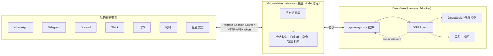

# ⚡ dsh-overdrive

> **DSH 界的 OpenClaw：把 DeepSeek Harness 变成"看得见思考过程、可以随时指挥"的聊天智能体。**

[**English**](README.md) | **中文**

`dsh-overdrive` 是 **Hermes Agent / OpenClaw 的多平台平替，但基于 DeepSeek Harness** —— 桥接进 **WhatsApp · Telegram · Discord · Slack · 飞书 · 钉钉 · 企业微信** —— 做到了它们做不到的事：**每一步思考和工具调用都在聊天里可见**，危险操作永远等你点头。

[](LICENSE)
[](https://github.com/temotee2103/dsh-overdrive/actions/workflows/ci.yml)
[](https://github.com/deepseek-ai/DeepSeek-Harness)
[](https://www.npmjs.com/package/@dsh-overdrive/gateway-core)
[](#支持的平台)
[](https://github.com/awesome-dsh-plugin/awesome-dsh-plugin)

---

## 为什么不用 OpenClaw？

Hermes / OpenClaw 是"终端智能体 + 20 多个聊天频道"，但它是**黑盒**——你只看到答案，看不到过程。

DSH 的 append-only session log 是它们抄不走的。`dsh-overdrive` 把这份能力变成**聊天原生**的体验：

- 🧠 **看得见思考** —— `/trace` 把 agent 的推理与工具调用轨迹回放成摘要卡片，就在聊天里
- 🤖 **指挥一个团队** —— `/task` 派发并行子任务，`/cron 0 9 * * * …` 用自带调度器安排定时任务
- 🔒 **危险操作你说了算** —— 危险工具调用会暂停，直到你点 **✅ 同意 / 🚫 拒绝**（Telegram / Discord / Slack / WhatsApp 原生按钮）
- 🚀 **一条命令部署** —— `docker compose up`，扫码即用。多数平台无需公网 URL。

---

## 效果长这样

<p align="center">
  
</p>

<details>
<summary>纯文本版</summary>

```
你:  帮我看看这个项目有多少个包
Agent:
       📋 轨迹（2 步）
       🧠 分析消息
       🛠️ mock.tool: echo
       ✅ Mock agent received: 帮我看看这个项目有多少个包

你:  /task 写一句营销口号
Agent:
       🤖 子任务已派出
       ✅ 任务完成 5c399346…

你:  /cron 0 9 * * * 每天给我一条技术新闻
Agent:
       ⏰ 定时任务已注册

你:  dangerous rm -rf /
Agent:
       ⚠️ 需要批准：执行危险操作（120s 内有效）
       [✅ 同意] [🚫 拒绝]   ← 点一下，agent 继续或停止
```

</details>

<details>
<summary>🎬 完整演示剧本 → docs/demo.md（中英双语）</summary>

按 [docs/demo.md](docs/demo.md) 的 3 分钟剧本录制：普通对话 → `/trace` 轨迹回放 → `/task` 子任务 → `/cron` 定时任务 → 审批按钮 → 收尾。
</details>

---

## 支持的平台

| 平台 | 接入方式 | 状态 |
|---|---|---|
| **Telegram** | Bot API（长轮询） | ✅ 真机验证通过（2026-08-16） |
| **WhatsApp** | Baileys + 扫码配对，原生交互按钮 | ✅ |
| **Discord** | Bot token，原生按钮 | ✅ |
| **Slack** | Socket Mode（免公网 URL） | ✅ |
| **飞书** | 官方 SDK，长连接 | ✅ |
| **钉钉** | Stream 模式（WebSocket，免公网 URL） | ✅ |
| **企业微信** | 回调 API（AES 加解密） | ✅ |
| CLI | stdin/stdout（开发与 E2E） | ✅ |

## 快速开始

**Docker 一条命令（推荐）：**

```bash
git clone https://github.com/temotee2103/dsh-overdrive && cd dsh-overdrive
cp deploy/.env.example .env        # 填 DEEPSEEK_API_KEY + TELEGRAM_BOT_TOKEN
docker compose -f deploy/docker-compose.yml up -d --build
# 控制台 http://localhost:3190/   DSH Web UI http://localhost:3080/
```

**已有 DSH？一行装完：**

```bash
npx dsh-overdrive-setup        # 引导向导：API key + 平台凭据（实时验证）
dsh plugin --profile web add @dsh-overdrive/gateway-core   # 装插件
npx dsh-overdrive-gateway                                   # 起 gateway
```

给 bot 发第一条消息后，输入 `/help` 查看全部命令。完整方案见 [docs/quickstart.md](docs/quickstart.md)

## 不会写代码？这样上手

不需要会编程。dsh-overdrive 的设计是：**一个人装好，全家都能用**。

1. 找一位懂行的朋友，花 **10 分钟**
2. 把下面这条发给他：

   **macOS / Linux：**
   ```bash
   curl -fsSL https://raw.githubusercontent.com/temotee2103/dsh-overdrive/main/install.sh | bash
   ```
   **Windows：** 下载 [install.ps1](https://raw.githubusercontent.com/temotee2103/dsh-overdrive/main/install.ps1)，右键 → "使用 PowerShell 运行"（或双击）

3. 安装器只问你 3 个问题（API key → 平台 → bot token），然后自动全部搞定
4. 之后**你**只需要聊天：发消息、`/help` 看命令、危险操作点 **✅ 同意 / 🚫 拒绝**

> English: No coding needed — have a friend run the 10-minute installer once; afterwards you just chat.

## 聊天命令

| 命令 | 作用 |
|---|---|
| `/help` | 命令列表 |
| `/trace` | 回放最近一轮轨迹（思考 + 工具调用） |
| `/task <需求>` | 派发子任务 |
| `/cron <分 时 日 月 周> <需求>` | 定时任务（自带 5 字段调度器） |
| `/crons` | 查看已注册的定时任务列表（含下次触发时间） |
| `/cronrm <任务id>` | 删除定时任务 |
| `/remind in 10 分钟 <内容>` | 一次性定时提醒（也支持 at HH:MM） |
| `/remember <事实>` | 记住关于你的事（长期记忆） |
| `/recall <关键词>` | 回忆相关记忆 |
| `/forget <记忆id>` | 删除一条记忆 |
| `/agents` | 子任务状态（简化） |
| `/new` | 重置会话 |

## 架构



`packages/gateway-core` 是一个 **DSH 插件**（已备好 `dsh.bundle.patch`），对外暴露 Remote Session Driver API；`packages/gateway` 是独立的多平台网关。"灵魂"——轨迹、审批、多智能体——都在插件里，不依赖平台适配器，经得起插件 API 变动。

## 开发

```bash
npm install
npm run build
npx vitest run     # 128+ 单元测试
npm run e2e        # 全链路 mock E2E（消息 / 审批 / 白名单）
```

## 文档

- 📦 [快速开始](docs/quickstart.md) · 🎬 [演示剧本](docs/demo.md) · 📣 [渠道清单](docs/launch.md) · 📤 [npm 发布](docs/publish.md)
- 🧪 [平台验收清单](docs/smoke-platforms.md)
- 📐 [设计文档](docs/superpowers/specs/2026-08-16-dsh-overdrive-design.md) · 🔭 [DSH 接口调研](docs/interface-report.md)

## 路线图

- [x] M1–M2b：协议、真实 DSH 桥接、国际平台
- [x] M3：飞书 / 钉钉 / 企业微信
- [x] M4：轨迹卡片、`/task` `/cron`、流式打字、图片收发、WhatsApp 原生审批按钮
- [x] M5：docker-compose 一键部署、Web 控制台、MIT + CI、npm 分发
- [x] v0.2a：语音转写 ASR（OpenAI 兼容端点，`ASR_API_KEY`）、飞书原生交互审批卡片、钉钉 actionCard 审批
- [ ] v0.2b：个人微信（实验性）

## 📚 收录情况

已被社区索引与精选列表收录：

| 列表 | 收录内容 |
| --- | --- |
| [awesome-dsh-plugin](https://github.com/awesome-dsh-plugin/awesome-dsh-plugin)（社区精选） | `dsh-overdrive#gateway-core` |
| [dsh-index](https://github.com/Sunrisepeak/dsh-index)（官方插件索引） | `dsh-overdrive` |
| [0xsline/awesome-deepseek-harness](https://github.com/0xsline/awesome-deepseek-harness) | `dsh-overdrive` |
| [Dominic789654/awesome-deepseek-harness](https://github.com/Dominic789654/awesome-deepseek-harness) | `dsh-overdrive` |
| [imsai-sh/awesome-deepseek-harness-plugins](https://github.com/imsai-sh/awesome-deepseek-harness-plugins) | `dsh-overdrive` |
| [Anil-matcha/awesome-dsh-plugin](https://github.com/Anil-matcha/awesome-dsh-plugin) | `dsh-overdrive` |
| [losebird/dsh-plugin-market](https://github.com/losebird/dsh-plugin-market) | `dsh-overdrive` |

## 开源协议

[MIT](LICENSE) © dsh-overdrive contributors
